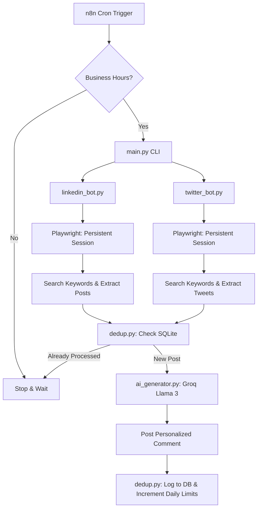

# 🤖 Auto Bidding Bot for LinkedIn & X (Twitter)


An intelligent, autonomous bidding and lead-generation bot that finds relevant job posts on **LinkedIn** and **X (Twitter)**, uses **Groq (Llama 3)** to generate personalized, human-like comments/bids, and posts them directly using browser automation. 

It is designed to be highly resistant to bot-detection via human-like interaction delays, persistent browser sessions, and business-hour restrictions.

---

## ✨ Features

- **Multi-Platform Navigation:** Built-in automation for both LinkedIn and X.
- **Smart Filtering:** Analyzes posts for hiring signals (e.g., "looking for developer", "budget $", "dm me") to avoid spamming irrelevant content.
- **AI-Powered Replies:** Utilizes the ultra-fast Groq API to draft 2-3 line, strictly personalized bids tailored to the exact requirements of the post.
- **Anti-Spam & Deduplication:** SQLite backend tracks processed posts to ensure the bot never comments on the same post twice.
- **Human Emulation:** Intelligent typing speeds, random scrolling, randomized mouse movements, and strict daily API limits to protect your accounts.
- **Workflow Automation (n8n):** Ready-to-go webhook/cron integration for hands-off deployment.

---

## 🏗️ Architecture



---

## 🚀 Getting Started

### 1. Installation

Clone the repository and set up a virtual environment:

```bash
git clone https://github.com/shivamrk022/Auto_Bidding_Bot.git
cd Auto_Bidding_Bot

# Create and activate virtual environment
python -m venv venv
source venv/Scripts/activate  # On Windows: venv\Scripts\activate

# Install dependencies
pip install -r requirements.txt
playwright install chromium
```

### 2. Configuration

Create a `.env` file in the root directory (this file is git-ignored):

```env
GROQ_API_KEY=gsk_xxxxxxxxxxxxxxxxxxxxxxxx
LINKEDIN_EMAIL=you@email.com
LINKEDIN_PASSWORD=yourpassword
TWITTER_EMAIL=you@email.com
TWITTER_PASSWORD=yourpassword
TWITTER_USERNAME=yourhandle
```
*Get your free Groq API key at: [console.groq.com](https://console.groq.com)*

You can configure your customized **Keywords**, **Daily Limits**, and **Personal Skills** in `config/config.py`.

### 3. Initialize Sessions (First Run)

To avoid CAPTCHAs, you must log in manually the first time. The script will save your session cookies in the `data/` folder for all future headless executions.

```bash
python main.py --platform linkedin
# Wait for the browser to open, verify login manually.

python main.py --platform twitter
# Wait for the browser to open, verify login manually.
```

### 4. Running the Bot

**Test the AI logic securely (No posting):**
```bash
python main.py --test-ai
```

**Run the full bot:**
```bash
python main.py --platform both
```

**View your performance statistics:**
```bash
python main.py --stats
```

---

## ⚙️ n8n Integration (Optional but Recommended)

You can schedule this bot completely hands-off using an n8n workflow:

1. Add a **Cron Node** set to run every 3 hours (`0 9,12,15 * * 1-5`).
2. Add an **IF Node** to ensure execution only during business hours:
   ```javascript
   {{ new Date().getHours() >= 9 && new Date().getHours() < 18 }}
   ```
3. Add an **Execute Command Node**:
   ```bash
   cd /path/to/Auto_Bidding_Bot && venv\Scripts\python main.py --platform both
   ```

---

## ⚠️ Disclaimer & Safety

> **Risk reminder:** LinkedIn and X prohibit automation in their Terms of Service. This repository is strictly for educational purposes. To minimize risk, daily limits are set critically low by default (e.g., 12 comments/day for LinkedIn). Do not dramatically increase these limits, or your account may be permanently restricted. Use responsibly and entirely at your own risk.
